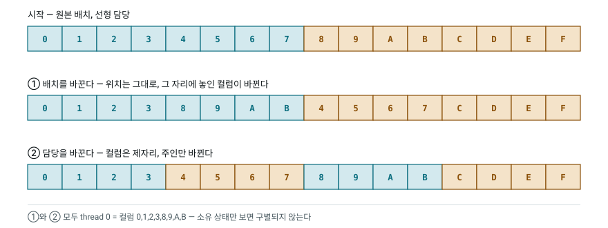
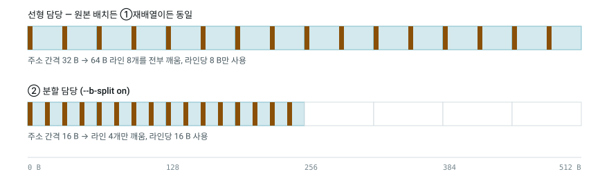
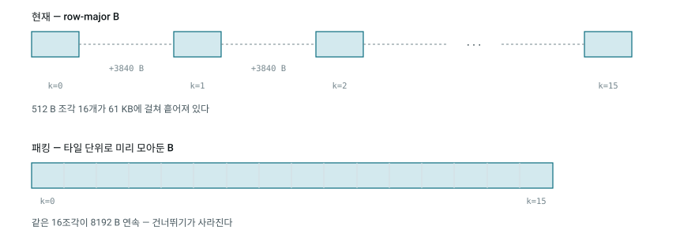

# B 행렬의 두 손잡이 — 배치냐 담당이냐

`--b-split`이 무엇을 바꾸고 무엇을 바꾸지 않는지, 그리고 "B의 레이아웃을 바꿔서
로드 효율을 올린다"와 어떻게 다른지.

wave가 실제로 무엇을 읽는지는 두 가지가 함께 정한다 — **값이 메모리 어디에 놓여
있나(배치)** 와 **어느 스레드가 몇 번 컬럼을 맡나(담당)**. 둘은 같은 결과에
도달할 수 있지만, 같은 것을 사지는 않는다.

| | 배치를 바꾼다 | 담당을 바꾼다 (`--b-split`) |
|---|---|---|
| 무엇을 옮기나 | B의 데이터 | 인덱스 계산식 |
| 런타임 비용 | 업로드 전 재배열 패스 | 0 — 컴파일 타임 상수 |
| B가 평범한 행렬로 남나 | 아니오 | 예 |

---

## 1. 두 손잡이는 같은 곳에 도착한다

<picture>
  <source media="(prefers-color-scheme: dark)" srcset="img/knobs-1-two-paths.dark.svg">
  
</picture>

스레드 2개 · 컬럼 16개로 줄인 그림이다. 어느 손잡이를 돌려도 "thread 0이 컬럼
0,1,2,3,8,9,A,B를 갖는다"는 같은 상태에 도착한다.

* **① 배치** — 위치 4~7에 컬럼 8~B를 옮겨 담았다. 담당(thread 0 = 앞 8개 위치)은 그대로.
* **② 담당** — 아무것도 옮기지 않고 위치 8~11의 주인만 thread 0으로 바꿨다.

도착점이 같기 때문에 "어느 컬럼을 누가 갖는가"만 보면 두 방법은 구별되지 않는다.

## 2. 그런데 메모리가 보는 것은 컬럼이 아니라 주소다

구별이 생기는 지점은 여기다. GPU는 wave 단위로 한 명령씩 실행한다. `regB[0]`을
채우는 로드 하나가 나갈 때 16개 레인이 각각 4바이트를 어디에서 읽느냐 — 그게
메모리 시스템이 보는 전부다.

그 주소는 **담당이 정한다.** 선형 담당에서 thread `x`는 언제나 위치 `8x`~`8x+7`을
맡으므로, 로드 `j`의 주소는 `32x + 4j` 바이트다. 그 자리에 어떤 컬럼 값이 놓여
있든 주소는 변하지 않는다.

> **배치만 재배열하고 담당을 그대로 두면 주소 패턴은 한 바이트도 바뀌지 않는다.**

<picture>
  <source media="(prefers-color-scheme: dark)" srcset="img/knobs-2-cachelines.dark.svg">
  
</picture>

블록 타일 한 줄(128 컬럼 = 512 B)을 64 B 캐시라인 8칸으로 나눈 것. 세로 막대
하나가 레인 하나의 4 B 읽기다. wave64에 레인은 64개지만 B 주소는 `x`에만
의존하므로 서로 다른 주소는 16개뿐이고 나머지는 브로드캐스트다.

| 로드 1회 (16개 주소) | 선형 담당 | 분할 담당 |
|---|---|---|
| 주소 간격 | 32 B | **16 B** |
| 걸치는 범위 | 484 B | **244 B** |
| 64 B 캐시라인 | **8개** | **4개** |
| 라인당 유효 바이트 | 8 B | **16 B** |
| LDS 뱅크 충돌 (`col % 32`) | 4-way | **2-way** |

`j=0`~`7` 전체를 합치면 두 경우 모두 512 B를 다 쓴다. 차이는 선형 담당이 거기까지
가는 동안 8개 라인이 전부 살아 있어야 한다는 점이다. 캐시가 넉넉하면 차이가 작고,
압박이 있으면 벌어진다 — 어느 쪽인지가 sweep이 답할 질문이다.

LDS 뱅크 수치는 하드웨어가 wave64를 한 번에 처리한다고 가정한 계산이다. RDNA
계열은 LDS를 32레인 단위로 쪼개 처리하는 경우가 많아 실제 충돌은 이보다 낮을 수
있다.

그리고 **n 방향에는 재배열로 얻을 것이 애초에 없다.** row-major B에서 thread `x`가
맡는 8개 컬럼 `8x`~`8x+7`은 이미 32 B 연속이기 때문이다. 더 뭉칠 것이 없다.

## 3. 배치만 살 수 있는 것 — k 방향

지금까지는 k가 고정된 한 줄 안의 이야기였다. 커널은 k를 16씩 걸어가고, B는
`B[k*N + col]`이라 **k가 1 늘 때마다 N floats를 건너뛴다.** N=960이면 3840 B다.

<picture>
  <source media="(prefers-color-scheme: dark)" srcset="img/knobs-3-k-direction.dark.svg">
  
</picture>

즉 `BK×BN` 타일 한 장(16×128)은 메모리에서 붙어 있지 않고, 3840 B씩 떨어진 512 B
조각 16개다. **이건 담당을 어떻게 재배정해도 못 고친다** — 컬럼 인덱스를 아무리
섞어도 행 사이 간격은 그대로다.

B를 타일 순서로 미리 모아두면 같은 타일이 8 KB 연속 구간 하나가 된다. 이건
담당으로는 표현 불가능하고 배치로만 가능하다.

네 변형 전부에 해당한다. `none`과 `shared_a`는 내부 루프에서 직접 이 간격을 밟고,
`shared_b`와 `shared_ab`는 LDS 스테이징 로드가 밟는다.

## 4. 둘 다 아닌 것 — 로드 폭

지금 셰이더는 `float`을 하나씩 읽는다. 레인당 4 B, 명령 8개. `vec4`로 읽으면 명령
2개로 끝나고, 이건 배치와 담당 어느 쪽과도 독립된 세 번째 축이다.

재미있는 건 **분할 담당이 `vec4`에 더 잘 맞는다**는 점이다. 분할 담당에서 한
스레드의 컬럼은 4개짜리 두 덩어리(`4x`~`4x+3`, `64+4x`~`64+4x+3`)이고 각각 16 B
정렬이다. 이 상태로 `vec4`를 쓰면 wave의 한 명령이 **256 B 완전 연속**을 덮는다.
선형 담당은 같은 `vec4`로도 32 B 간격이라 512 B에 절반만 채운다.

## 정리

| | 배치 재배열 | 담당 재배정 (구현됨) |
|---|---|---|
| 무엇을 옮기나 | B의 데이터 | 인덱스 계산식 |
| 런타임 비용 | 업로드 전 재배열 패스 | 0 — 컴파일 타임 상수 |
| B가 평범한 행렬로 남나 | 아니오 | 예 |
| 로드 명령 하나가 깨우는 캐시라인 | 8 → 8 (변화 없음) | 8 → 4 |
| 스레드별 연속성 (n 방향) | 이미 연속 — 얻을 것 없음 | 4개씩 연속 |
| k 방향 3840 B 건너뛰기 | 없앨 수 있음 | 불가능 |

n 방향은 `--b-split`으로 이미 커버된다 — 배치를 바꿔도 같은 자리에 도달하는데,
비용이 없는 쪽으로 도달한 것이다. **진짜 배치 축은 k 방향 패킹**이고, 그건
담당으로는 못 하는 일이다.

## 아직 없는 것: `--b-pack`

다섯 번째 축의 스케치. 호스트가 B를 타일 순서로 미리 모아 올리고, 셰이더는
`B_PACKED`일 때 `B[tile*BK*BN + kk*BN + nn]`으로 읽는다. 기존 축들과 마찬가지로
`off`는 지금 커널과 바이트 단위로 동일하게 유지하고, 결과는 여전히 비트 동일해야
하므로 `--mode check`가 그대로 검증한다. `--b-split`과 직교하므로 둘을 조합한
sweep도 그대로 된다.

---

그림 원본은 [`img/`](img/)에 라이트/다크 두 벌로 들어 있다. 벤치마크 자체는
[README](../README.md) 참고.
